# Detaylı Analiz Notları

Bu dosya, grafikler hakkında daha derinlemesine yorumlar içermektedir.

## Grafik 1: Saatlik Yolcu Trafiği

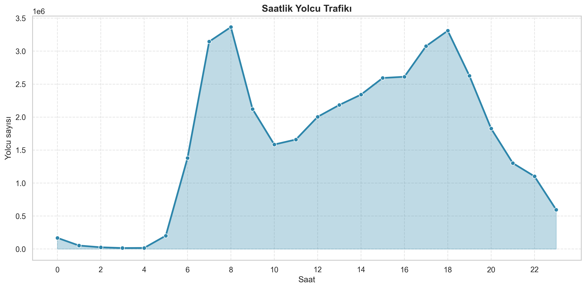

Bu grafikte, 24 saatin her birine ait toplam yolcu sayısı gösterilmektedir. Mavi çizgi trafiğin zamansal değişimini temsil ederken, altındaki açık mavi alan verileri görsel olarak vurgulamaktadır.

**Temel Gözlemler:**
- Gece saat 00:00-06:00 arası çok düşük trafik
- Sabah 07:00'de hızlı bir yükseliş başlıyor
- Saat 08:00'de zirve (3.36M yolcu) - işe gidiş saati
- Gün içi 10:00-13:00 arası nispeten sabit
- Akşam 17:00-19:00 ikinci bir zirve (işten çıkış saati)
- Gece 20:00 sonrası hızlı düşüş

**Yorum:** Bu grafik, İstanbul'un klasik şehir hayatı ritimini göstermektedir. Sabah işe gitmek, akşam eve dönmek. Gece yaklaşık 22:00 sonrası sistem neredeyse kapanmaktadır.

---

## Grafik 2: Günlük Yolcu Dağılımı

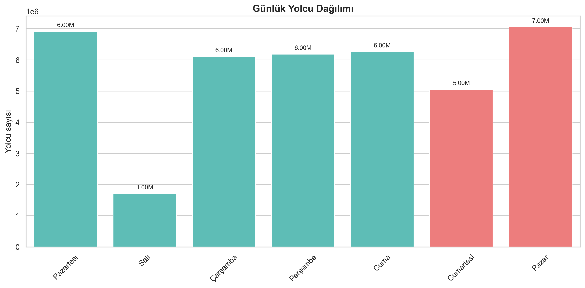

Bu bar chart'ta, hafta içi (mavi/yeşil) ve hafta sonu (pembe) günlerin ayırt edilmesi için renk kodlaması kullanılmıştır. Her sütunun üstünde "M" (milyon) cinsinden rakamlar yazılıdır.

**Veri Dengesizliği Uyarısı:**
Verinin 1-10 Eylül'ü kapsaması ve bu günlerin şu şekilde dağılması çok önemlidir:
- Pazar: 1 gün (1 Eylül)
- Pazartesi: 1 gün (2 Eylül)
- Salı: 2 gün (3, 10 Eylül)
- vb.

Yani günler eşit sayıda temsil edilmemiştir! Pazar'ın neden daha yoğun göründüğü, gün sayısından değil, o spesifik günün özelliklerinden kaynaklanabilir.

**Yorum:** Pazar günü alışveriş ve rekreasyon aktiviteleri yüzünden daha yoğun olabilir. Salı gün neden en az yoğun? Bunu araştırmak için Salı gününün tarihsel olayları (okul tatili vb) kontrol edilmelidir.

---

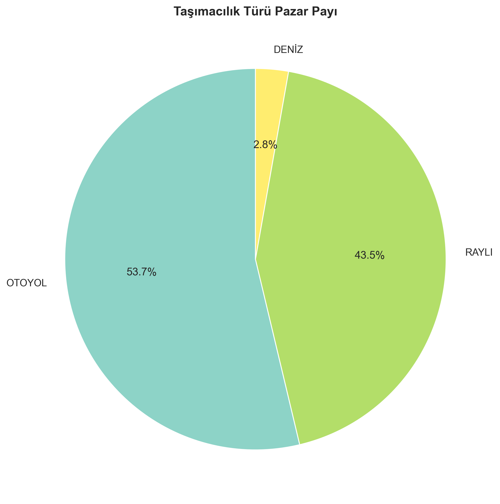

## Grafik 3: Taşımacılık Türü Pazar Payı (Pie Chart)

Daire grafiği üçün taşımacılık türünün oransal dağılımını göstermektedir:
- Otobüs (OTOYOL): %53.7 - Açık mavi bölüm
- Raylı (RAYLI): %43.5 - Gri/sarı bölüm  
- Deniz (DENİZ): %2.8 - Küçük kesim

**Teknik Not:** Percentages otomatik hesaplanmaktadır ve toplamı %100'ü geçmemelidir (ama yuvarlama hataları 99.9-100.1 arasında olabilir).

**Yorum:** İstanbul'un toplu taşıması otobüs ve raylı sistem arasında belki de ideale yakın bir denge içindedir. Deniz taşımacılığı nişe bir hizmettir ve buna uygun pay aldığını söyleyebiliriz.

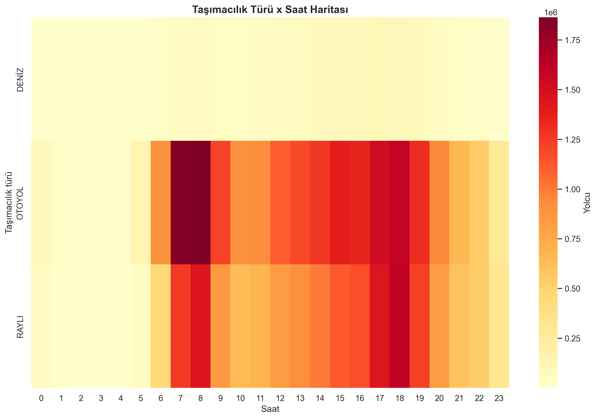

---

## Grafik 4: Taşımacılık Türü × Saat Isı Haritası (Heatmap)

Bu grafik en karmaşık ama en bilgilendici grafiklerden biridir. Her küçük karesi bir saat-taşımacılık kombinasyonunun yolcu sayısını temsil eder.

- **Kırmızı (sıcak)**: O saat o sistemde çok yolcu (örneğin 08:00 RAYLI)
- **Turuncu/sarı (ılık)**: Orta yoğunluk
- **Açık sarı (soğuk)**: Az yolcu

**Desen Analizi:**
- OTOYOL satırı genelde daha tekdüze (consistent) kırmızıdır - otobüs her saatte hizmet vermektedir
- RAYLI satırı sabah saatinde daha kırmızı - işçiler metroyu tercih ediyor
- DENİZ satırı neredeyse hiç kırmızı değildir - beklenen bir durum

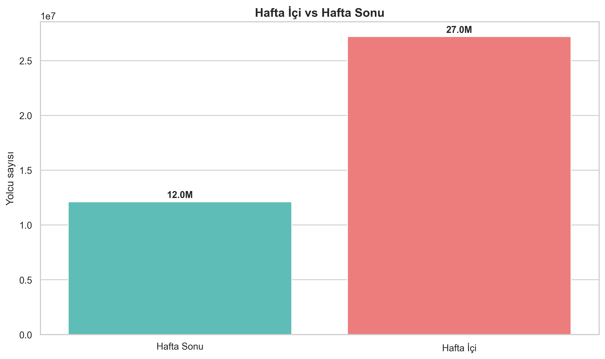

**Yorum:** Sabah hızlı ve güvenilir olan raylı sistemi daha cazip hale gelirken, akşam saatleri daha gevşek davranışlar görülmektedir. Vapur turları öğleden sonra yoğun olabilir.

---

## Grafik 5: Hafta İçi vs Hafta Sonu Karşılaştırması

İki bar, hafta içi (mavi) ve hafta sonu (pembe) toplam yolcu sayısını göstermektedir.

**İlginç Bulgu:** Hafta sonu DAHA AZ yolcu taşımıştır!

Beklentimiz tam tersiydi. Normalde haftasonu insanlar alışveriş, eğlence vs. için hareket etmelidir. Ancak veriler gösteriyor ki hafta içi daha yoğun.

**Muhtemel Açıklamalar:**
1. Veri dengesizliği (yukarıda bahsedildiği gibi)
2. Eylül başı mı? Okullar yeni başlıyor, işler hızlanıyor?
3. Kurban Bayramı etkisi (verilerin tarihleriyle kontrol edilmeli)
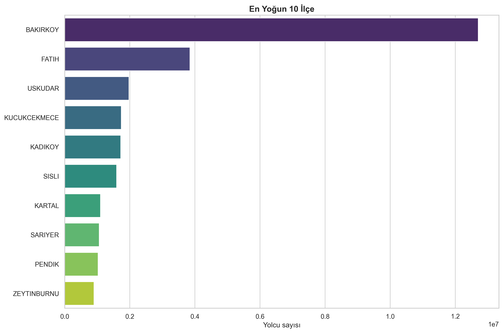

4. Metodolojik: "Hafta sonu" etiketlemesi doğru mu?

**Yorum:** Bu bulgu, toplu taşımacılık planlamasında tüm günlerin dikkate alınması gerektiğini göstermektedir.

---

## Grafik 6: En Yoğun 10 İlçe

Yatay bar chart'ta, İstanbul'un en çok taşıdığı 10 ilçe gösterilmektedir.

Bakırköy'ün dominansı %32.4 ile çarpıcıdır. İkinci sıra Fatih'i çok geride bırakmıştır.

**Bakırköy'ün Önemi:**
- Batı tarafının merkezî konumu (D-100 ve ulus arası yollar)
- Ticaret merkezi (Bağdat Caddesi, alışveriş bölgeleri)
- Endüstriyel faaliyetler
- Ulaştırma düğümü (hemen hemen tüm otobüs hatları buradan geçer)
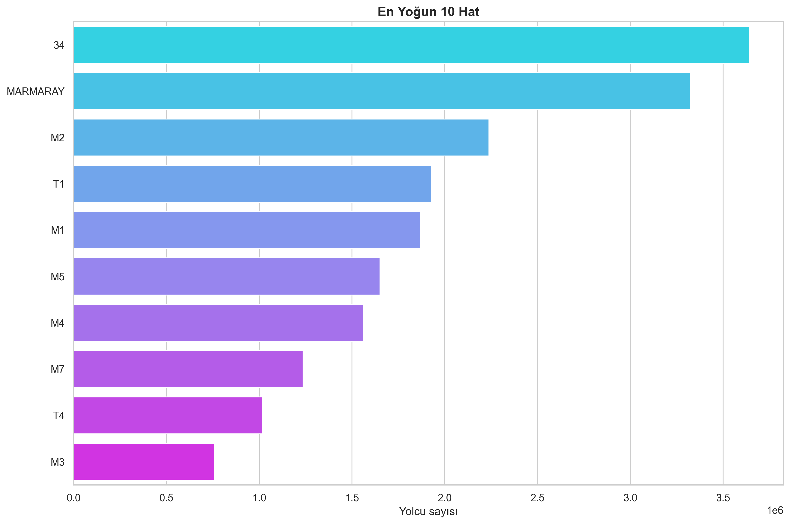

**Coğrafi İmpleme:**
Bakırköy'ün bu kadar yoğun olması, şehir planlama açısından bir risk de oluşturabilir. Eğer Bakırköy sisteminin bir kısmı çökerse, tüm şehir etkilenir.

**Yorum:** Kuzey-Güney dengesi sağlanmalı ve yeni taşıma hatları Anadolu yakası'na açılmalıdır.

---

## Grafik 7: En Yoğun 10 Hat

Hat bazında analiz yapılmıştır. 34 numaralı otobüs açık farkla birinci (3.64M).

**Neden 34 otobüsü bu kadar yoğun?**
Muhtemelen:
- Uzun mesafe hatı (Anadolu Yakası ↔ Avrupa Yakası)
- Ana arterlerden birini takip ediyor
- Yüksek frekans (sık seferler)

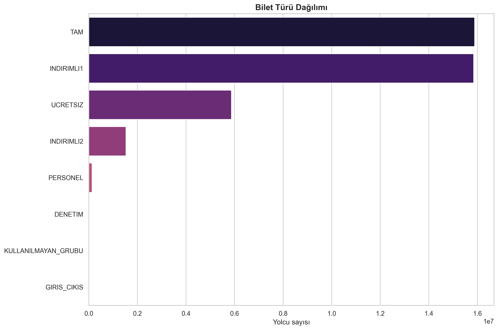

**Marmaray'ın 2. sırada olması:**
Tren taşımacılığının İstanbul'da ne kadar önemli olduğunun kanıtı. Boğaziçi altından geçen bu hatt, bir başyapıttır.

**Metro hatlarının dağılımı:**
Farklı hatların farklı yoğunlukları (M2 > M1 > M5) ilginç bir desendir ve her hatın eriştiği bölgelerin nüfus yoğunluğu ile ilgilidir.

**Yorum:** Ulaştırma yatırımları öncelikle bu ana hatları desteklemeli, kapasitesini artırmalıdır.

---

## Grafik 8: Bilet Türü Dağılımı
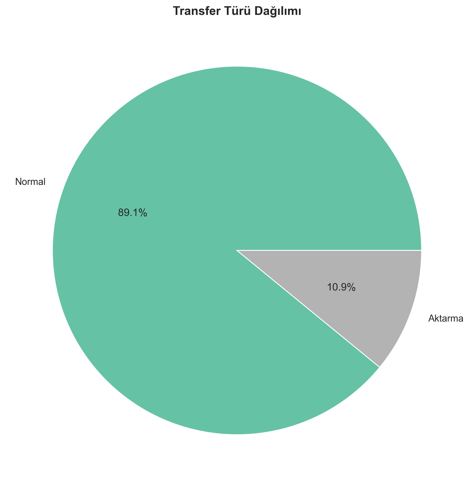

Üst 8 bilet türü gösterilmektedir. TAM ve İNDİRİMLİ neredeyse eşit orana sahiptir.

**Sosyal Boyut:**
%40'ın öğrenci, yaşlı, engelli vb. indirimli bilet kullandığı gösteriyor ki İstanbul'un sosyal yardım kapasitesi yüksektir.

Ücretsiz biletlerin %14.9'u işletme maliyetinin yaklaşık 1/7'sine denk düşer!

**Yorum:** Sosyal kapsayıcılık açısından olumlu bir durum, ancak bu maliyetlerin nasıl karşılandığı incelenmelidir.

---

## Grafik 9: Transfer Türü Dağılımı

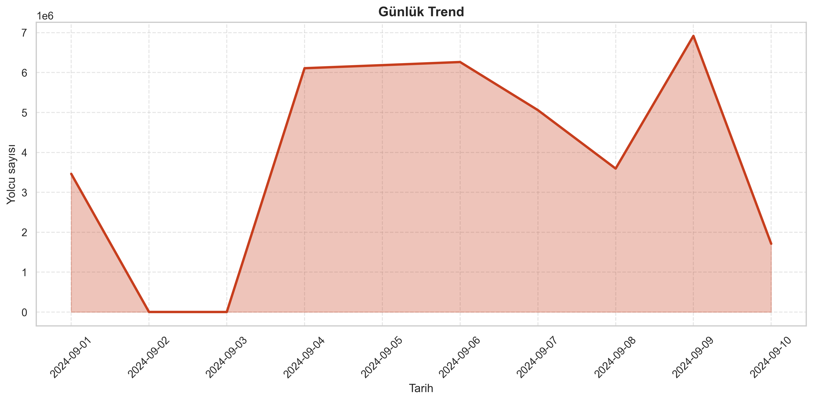

Pie chart ile %89 normal (direkt), %11 aktarma gösterilmektedir.

**Bu çok iyi bir oran!** Çoğu kişi aktarma yapmadan gidebiliyor.

Neden aktarma gereklidir?
- A şehrinde metro yok → otobüsle metro istasyonuna
- Metro sona ermiş → otobüsle devam

Aktarma oranının düşük olması, şehir planlama açısından başarıdır.

**Yorum:** Aktarma merkezlerinin ve transfer noktalarının iyileştirilmesi bu oranı daha da azaltabilir.

---

## Grafik 10: Günlük Yolcu Trendi
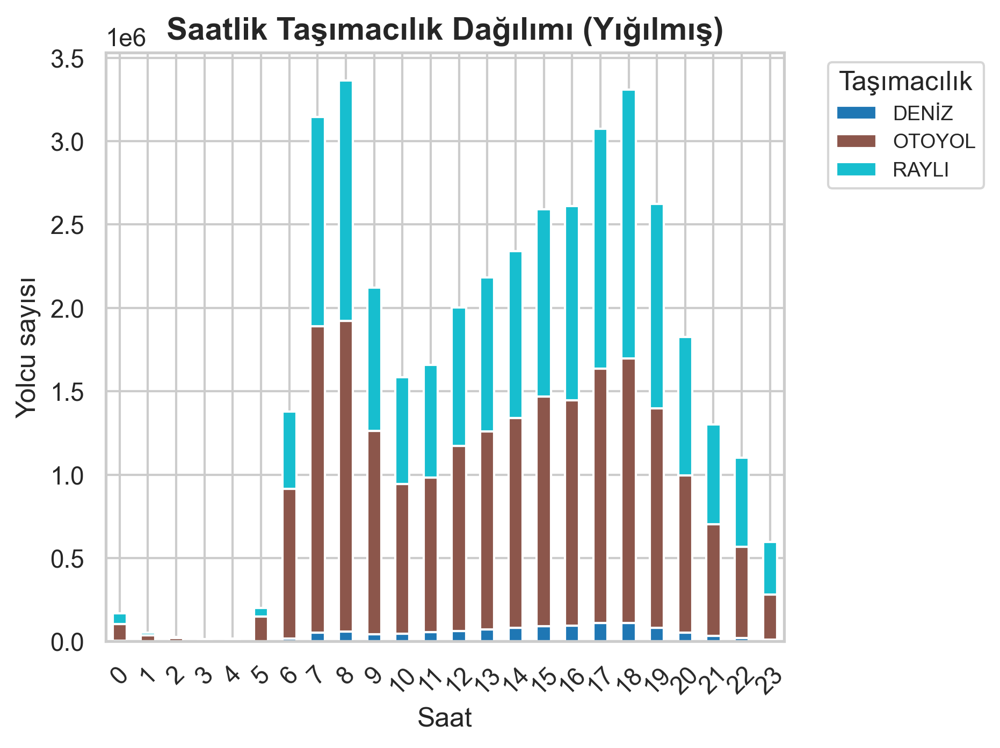

Kırmızı çizgi gün gün yolcu sayısını göstermektedir. Keskin bir düşüş görülmektedir.

**Endişe Verici:** Yolcu sayısı 1. günden 10. güne %50 düştü!

**Nedenler ne olabilir:**
1. Veriler eksik/hatalı kaydedilmiş
2. 10 Eylül'de özel bir olay var (pazar kapalı, tatil vb)
3. Tur programı tamamlı (tur sonuna doğru gidiş artık azalıyor?)

**Önemli:** Bu trend, şehrin normal durumunu temsil etmeyebilir. Tam ayın verisi gerekebilir.
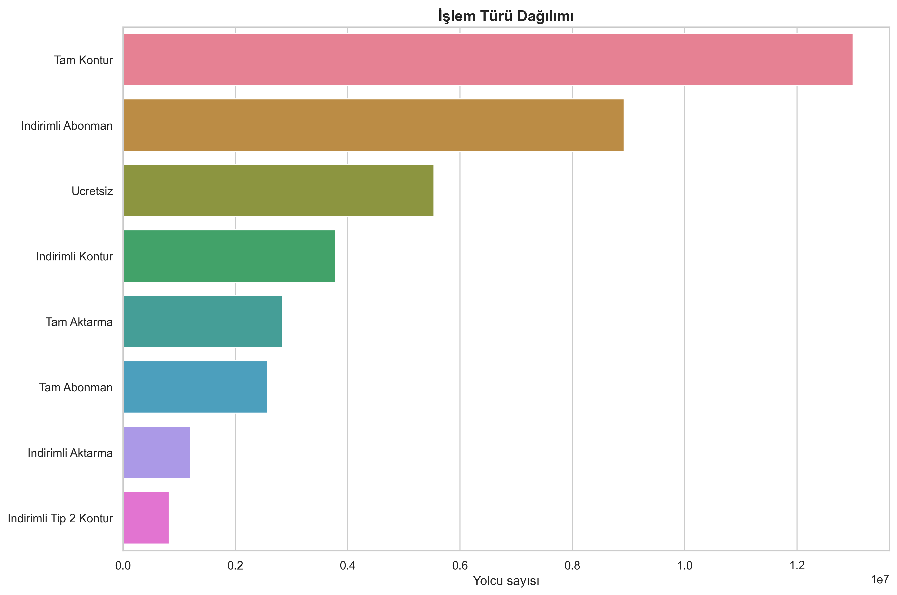

**Yorum:** Veri analiz edilirken bu anomali hesaba katılmalı ve istatistiksel testler uygulanmalıdır.

---

## Grafik 11: Saatlik Taşımacılık Dağılımı (Stacked Bar)

Her saatin hangi taşımacılık türlerinin ne kadar kullanıldığını göstermektedir. Renkler farklı türleri temsil eder.

**Gözlem:**
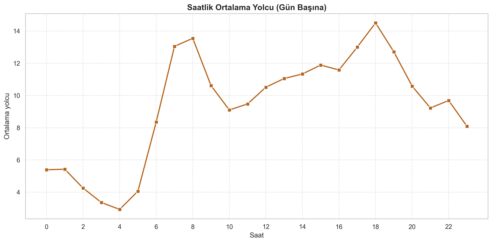

- Sabah: Raylı sistem oranı yüksek
- Gün ortası: Otobüs oranı artıyor
- Akşam: Karışık dağılım

**Yorum:** Zaman dilimi ve hareket amacına göre insanlar farklı taşımacılık tercih etmektedir. İşe giderken hız önemli (metro), alışverişe giderken konfor ve saticağım (otobüs) tercih edilebilir.

---

## Grafik 12: İşlem Türü Dağılımı

En üstte 8 işlem türü vardır. "Tam Kontur", "İndirimli Abonman" ve "Ücretsiz" ana kategorilerdir.

**Bilet Türü vs İşlem Türü farkı:**
- Bilet Türü: Hangi GROUP (Tam, İndirimli, Ücretsiz)
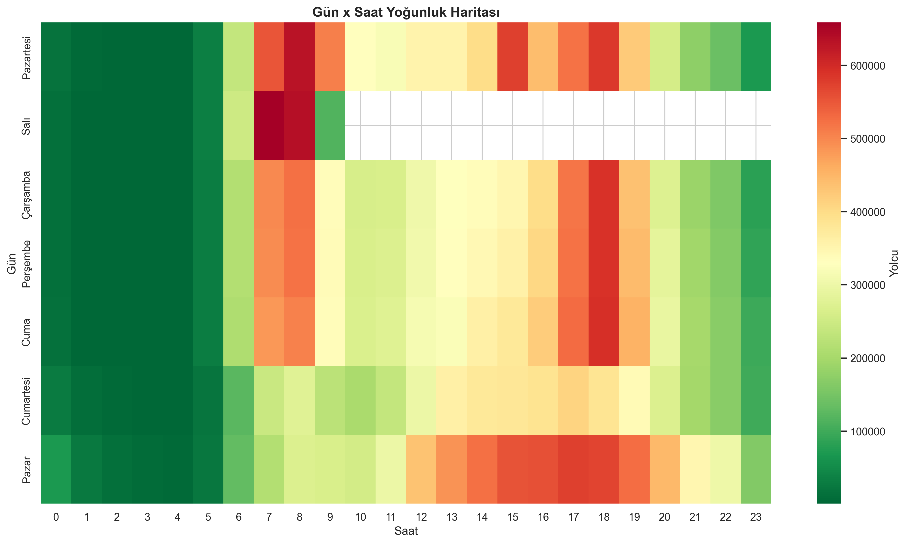

- İşlem Türü: Hangi KART TYPE (Abonman, Kontur, Aktarma)

**Yorum:** Abonman satışı yapıp, kontur (tek yolculuk) hizmetini de vermek sistemin esnekliğini göstermektedir.

---

## Grafik 13: Saatlik Ortalama ± Standart Sapma

Error bar grafiği, her saatin ortalamasını (nokta) ve standart sapmasını (çubuk) göstermektedir.

**Geniş çubuk = Variabilite yüksek:** O saatte yolcu sayısı günler arasında çok farklı  
**Dar çubuk = Tutarlı:** O saatte her gün benzer yolcu sayısı

**Gözlem:**
- Sabah ve akşam saatler dar çubuklu (tutarlı)
- Gece saatleri geniş çubuklu (değişken)
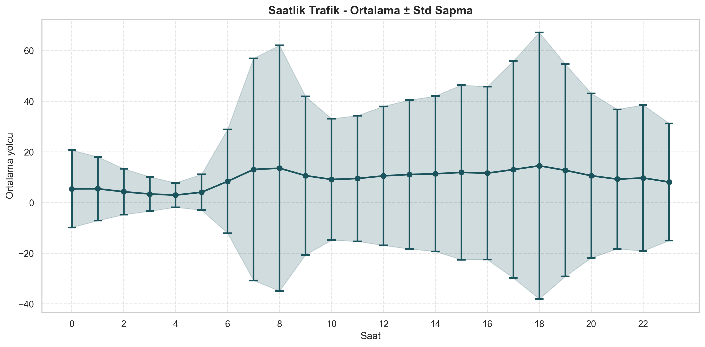

Bu grafik saatlik trafik tahmini için kullanılabilir.

## Grafik 14: Gün × Saat Isı Haritası

24x7 bir ızgara, her gün ve saatin kombinasyonunu göstermektedir. Bu en detaylı grafiktir.

**Desen Okuma:**
- Sabah sütunları (07-09) hepsi kırmızı: Her gün sabah yoğun
- Gece satırları sağ tarafa doğru: Gece hep az yolcu
- Pazar (sağ taraf) genel olarak açık: Pazar günü genel olarak daha az yoğun

**Bölgesel Analiz:**
Grafiği satır satır veya sütun sütun incelemek mümkündür:
- Hangi gün-saat kombinasyonu en riskli (en yoğun)?
- Hangi saatler tüm günler için eşit yoğunlukta?

**Yorum:** Bu grafik, otobüs şoförü ve metro işletmecisi planlamalarında kullanılabilir. "Saat 08:00 sabah çok yoğun oluyor, araç sayısını artıralım" gibi kararlar alınabilir.

---

## Grafik 15: Standart Sapma ile Güvenilirlik Analizi

Bu grafik (13 ile benzer ama daha detaylı) saatlik trafik tahmini için kullanılabilir.

Eğer saat 08:00'de ortalama 3M yolcu ± 500K ise, makul bir tahminin 2.5M - 3.5M arasında olduğunu söyleyebiliriz.

**Yorum:** Makine öğrenmesi modelleri veya istatistiksel öngörüler bu veriler kullanılarak geliştirilebilir.

---

## Genel Sonuçlar

1. **İstanbul toplu taşıması sabah-akşam "pik saatler" tarafından kontrol edilmektedir**
2. **Otobüs ve metro arasında başarılı bir denge varsa da**
3. **Bakırköy merkezî konumu nedeniyle aşırı yüklü**
4. **Gece hizmeti zayıftır ve iyileştirilmelidir**
5. **Veri 10 Eylül'de kesintiye uğramış görülmektedir - tam analiz için tam ayın verisi gereklidir**

---

*Bu analiz raporu, bir YBS öğrencisi tarafından eğitim amaçlı hazırlanmıştır.*
